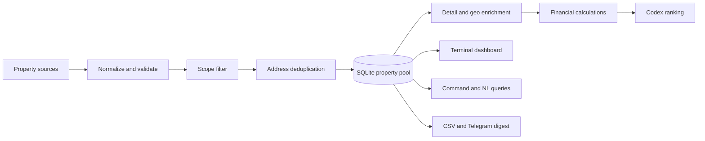

# Kash — Real Estate Intelligence Pipeline

Kash is a local-first property research system for building, enriching, ranking, and
monitoring a home-buying shortlist. It combines structured listing data, configurable
search criteria, public geospatial services, financial estimates, and a terminal
dashboard backed by SQLite.

The current implementation is tuned for Staten Island, New York, but the adapter and
preference layers are designed to be extended to other markets.

## Highlights

- SQLite property pool as the single source of truth
- Provider adapters for RentCast and managed Zillow collection through Apify
- Pydantic validation and address-based entity resolution
- Protected human notes, rankings, favorites, and offer workflow fields
- Price/status change tracking with daily digests
- Census geocoding and flood-zone enrichment, plus offline neighbourhood and zoned-school
  lookup from frozen polygons
- Mortgage, PITI, cap-rate, and cash-on-cash estimates
- Natural-language filtering and ranking over a subscription model ladder (ChatGPT, Claude,
  Gemini CLIs — no API keys), with per-user request budgets that rotate rather than cut off
- Textual terminal dashboard plus a deterministic command shell
- CSV export, rotating search coverage, backups, and macOS scheduling

## Architecture



Every source normalizes into the canonical `Listing` model. Existing rows are matched
by normalized street address and ZIP. Provider refreshes can update sourced facts, but
they cannot overwrite human-authored analysis, notes, rankings, favorites, viewing
status, or offer state.

## Main components

| Path | Responsibility |
|---|---|
| `kash/schema.py` | Canonical 81-field listing contract |
| `kash/store.py` | SQLite schema, merge rules, changelog, and seed import |
| `kash/adapters/` | Mock, RentCast, and managed Zillow source adapters |
| `kash/pipeline.py` | Validation, scope filtering, deduplication, and merge |
| `kash/enrich/` | Zillow detail data, Census geocoding, and FEMA flood zones |
| `kash/finance.py` | Derived property and financing metrics |
| `kash/query.py` | Whitelisted, parameterized read-only query layer |
| `kash/nl.py` | Natural-language questions translated into structured queries |
| `kash/rank.py` | Codex-assisted ranking of newly discovered listings |
| `kash/orchestrator.py` | Resilient daily update sequence |
| `kash/llm.py` | Subscription-CLI model ladder (codex / claude / agy) with fallback |
| `kash/usage.py` | Per-user request budgets that rotate to the next model, not off |
| `kash/schedule.py` | Per-source cadence, plus retry backoff after a failure |
| `kash/sweep.py` | Rotating price band, so one run covers a slice of the range |
| `kash/lifecycle.py` | Ages a listing to off_market — only on a search that proves absence |
| `kash/schools.py` | Zoned elementary school from frozen DOE polygons, offline |
| `kash/geo_static.py` | Neighbourhood from frozen NTA polygons, offline |
| `kash/crm.py` | The buyer's own record: tours, offers, ratings, notes |
| `kash/prefs_editor.py` | What the dashboard may change in `preferences.yaml`, and how |
| `kash/completeness.py` | What "complete" means per field, and how far the pool is from it |
| `kash/ledger.py` | Why a field is still empty, with per-row retry backoff |
| `kash/notifications.py` | Alert scope, listing briefs, and Telegram chunking |
| `kash/health.py` | Run verdict, and alerts that fire on new problems only |
| `kash/backup.py` | Verified pre-run snapshot through WAL (never a file copy) |
| `dashboard.py` | Textual terminal dashboard |
| `dashboard.sh` | Dashboard launcher: any directory, checks the install, fixes TERM |
| `shell.py` | Lightweight command-line REPL |
| `run_update.py` | The nightly cycle (see below) |

## Quick start

Requirements: Python 3.11+ and the packages in `requirements.txt`.

```bash
python3 -m venv .venv
source .venv/bin/activate
pip install -r requirements.txt
cp preferences.example.yaml preferences.yaml
```

Kash intentionally does not publish its live database or personal property shortlist.
To initialize a pool, provide your own compatible seed CSV at
`archive/SI_July2026_Active_Properties.csv`, or adapt the path in the entry scripts.
The included `extract_docx_to_csv.py` demonstrates importing the original 16-column
Word-table format.

```bash
# Exercise the complete merge pipeline with fixture provider records
python run_fetch.py --source mock

# Launch the visual dashboard (wrapper: works from any directory, checks the
# python/textual install, fixes locale/TERM for Textual rendering)
./dashboard.sh
# equivalent, without the preflight:
python dashboard.py

# Launch the command shell
python shell.py
```

## Live providers

Copy `.env.example` to `.env` and add only the credentials for sources you intend to
use:

```bash
cp .env.example .env
python run_fetch.py --source rentcast
python run_fetch.py --source zillow --limit 5
```

The Zillow adapter uses a third-party managed scraper. Zillow restricts scraping in its
Terms of Service; review the provider terms and applicable law before enabling it.
RentCast is the preferred licensed source.

## Daily workflow

`run_update.py` performs, under an exclusive lock so two runs cannot overlap:

1. Verified SQLite backup — a failed backup aborts the run rather than proceeding
2. Scheduled provider fetch and merge (per-source cadence; a failed source backs off
   1/2/4 days instead of retrying daily, which is what exhausted a monthly API quota)
3. Ageing: listings absent from a search that came back *under* its result cap
4. Listing-detail enrichment
5. Census geocoding and flood lookup, then neighbourhood and school zone from frozen
   polygons (offline, no API call)
6. Description signals, then model ranking for new listings
7. Completeness audit — what is missing, who fills it, and what that blocks
8. Change digest and optional Telegram delivery — plus, for recipients who switched
   voice on, one spoken briefing per person after their written messages
9. Full CSV export, then a health verdict: new problems are pushed, repeats are not,
   and a failed run exits non-zero so the scheduler's status means something

```bash
python run_update.py --no-telegram
python run_update.py --no-voice                  # written report only
python run_update.py --sources zillow --limit 10
```

The spoken briefing (`kash/voice_digest.py`) is written separately from the digest rather
than read off it: aloud, the digest is bare numbers and internal match keys. Voice is
opt-in per recipient — settings live with the chat bot, and anyone who has not turned it
on gets exactly what they got before. Every failure in the audio path is caught and
reported: the written report has already been delivered by then, and must never be lost
or re-sent because speech broke. `kash/voice_link.py` is the optional link to the
renderer, which lives beside `sendVoice` in the sibling Hermes_Telegram_Bridge repo.

On macOS, `scripts/install_scheduler.sh` installs a launchd job that runs the update at
07:00 each day.

## Query examples

From `shell.py` or the dashboard filter bar:

```text
filter tier=A list_price<=750000 sort:list_price limit:10
filter flood_zone!=X sort:list_price
show 45 Fairlawn Loop
ask which active homes under 800k have the lowest flood risk?
```

The language model never receives the database and never writes SQL. It returns a
structured filter specification; Kash validates the requested fields and operators,
then executes a parameterized query locally.

### Telegram access editor

Press `F2` in the dashboard to manage bot access. Highlight an existing user and press
`e`, or press `n` to add a Telegram ID. The form accepts:

```text
123456789 name="Jane Doe" status=allowed access=read message="Original request text"
```

`message=` and `first_message=` are aliases. Use `message=""` to clear the stored first
message. This is an editable audit/display field for the user's first incoming message;
it does not configure a personalized bot greeting.

## Data and privacy

The following stay local and are excluded from Git:

- `.env` and provider credentials
- `pool.db`, backups, changelog state, and generated exports
- Personal preferences and buyer criteria
- Source Word documents and property CSVs, including personal notes

Use `preferences.example.yaml` and `.env.example` as safe starting templates.

## Project status

The core ingestion, merge, enrichment, ranking, dashboard, scheduling, and export paths
are implemented, along with run health and alert de-duplication, listing lifecycle ageing,
per-field completeness auditing, and offline neighbourhood and school-zone lookup. Planned
work includes stronger provider coverage, database migrations, comparable-sales/ARV
automation, and commute/routing enrichment. See [`ROADMAP.md`](ROADMAP.md) for the detailed
build history.

## Disclaimer

Kash is a research and decision-support project, not financial, legal, lending, flood,
or real-estate advice. Verify listing facts and calculated estimates with authoritative
sources and qualified professionals before making a purchase decision.
