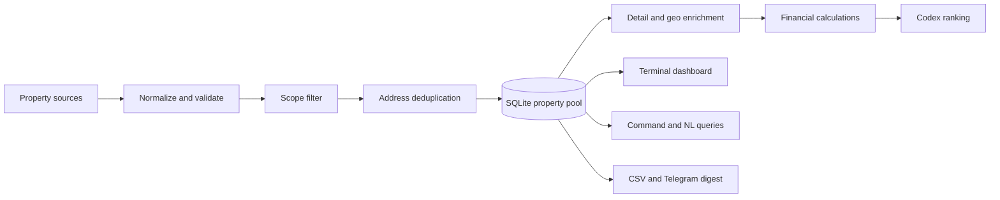

# Kash — Real Estate Intelligence Pipeline

Kash is a local-first property research system for building, enriching, ranking, and
monitoring a home-buying shortlist. It combines structured listing data, configurable
search criteria, public geospatial services, financial estimates, and a terminal
dashboard backed by SQLite.

The current implementation is tuned for Staten Island, New York, but the adapter and
preference layers are designed to be extended to other markets.

## Highlights

- SQLite property pool as the single source of truth
- Provider adapters for RentCast and managed Zillow collection through Apify
- Pydantic validation and address-based entity resolution
- Protected human notes, rankings, favorites, and offer workflow fields
- Price/status change tracking with daily digests
- Census geocoding and FEMA flood-zone enrichment
- Mortgage, PITI, cap-rate, and cash-on-cash estimates
- Codex-assisted natural-language filtering and automatic ranking
- Textual terminal dashboard plus a deterministic command shell
- CSV export, rotating search coverage, backups, and macOS scheduling

## Architecture



Every source normalizes into the canonical `Listing` model. Existing rows are matched
by normalized street address and ZIP. Provider refreshes can update sourced facts, but
they cannot overwrite human-authored analysis, notes, rankings, favorites, viewing
status, or offer state.

## Main components

| Path | Responsibility |
|---|---|
| `kash/schema.py` | Canonical 81-field listing contract |
| `kash/store.py` | SQLite schema, merge rules, changelog, and seed import |
| `kash/adapters/` | Mock, RentCast, and managed Zillow source adapters |
| `kash/pipeline.py` | Validation, scope filtering, deduplication, and merge |
| `kash/enrich/` | Zillow detail data, Census geocoding, and FEMA flood zones |
| `kash/finance.py` | Derived property and financing metrics |
| `kash/query.py` | Whitelisted, parameterized read-only query layer |
| `kash/nl.py` | Natural-language questions translated into structured queries |
| `kash/rank.py` | Codex-assisted ranking of newly discovered listings |
| `kash/orchestrator.py` | Resilient daily update sequence |
| `dashboard.py` | Textual terminal dashboard |
| `shell.py` | Lightweight command-line REPL |

## Quick start

Requirements: Python 3.11+ and the packages in `requirements.txt`.

```bash
python3 -m venv .venv
source .venv/bin/activate
pip install -r requirements.txt
cp preferences.example.yaml preferences.yaml
```

Kash intentionally does not publish its live database or personal property shortlist.
To initialize a pool, provide your own compatible seed CSV at
`archive/SI_July2026_Active_Properties.csv`, or adapt the path in the entry scripts.
The included `extract_docx_to_csv.py` demonstrates importing the original 16-column
Word-table format.

```bash
# Exercise the complete merge pipeline with fixture provider records
python run_fetch.py --source mock

# Launch the visual dashboard
python dashboard.py

# Launch the command shell
python shell.py
```

## Live providers

Copy `.env.example` to `.env` and add only the credentials for sources you intend to
use:

```bash
cp .env.example .env
python run_fetch.py --source rentcast
python run_fetch.py --source zillow --limit 5
```

The Zillow adapter uses a third-party managed scraper. Zillow restricts scraping in its
Terms of Service; review the provider terms and applicable law before enabling it.
RentCast is the preferred licensed source.

## Daily workflow

`run_update.py` performs:

1. SQLite backup
2. Scheduled provider fetch and merge
3. Listing-detail enrichment
4. Census geocoding and FEMA flood lookup
5. Codex ranking for new listings
6. Change digest and optional Telegram delivery
7. Full CSV export

```bash
python run_update.py --no-telegram
python run_update.py --sources zillow --limit 10
```

On macOS, `scripts/install_scheduler.sh` installs a launchd job that runs the update at
07:00 each day.

## Query examples

From `shell.py` or the dashboard filter bar:

```text
filter tier=A list_price<=750000 sort:list_price limit:10
filter flood_zone!=X sort:list_price
show 45 Fairlawn Loop
ask which active homes under 800k have the lowest flood risk?
```

The language model never receives the database and never writes SQL. It returns a
structured filter specification; Kash validates the requested fields and operators,
then executes a parameterized query locally.

## Data and privacy

The following stay local and are excluded from Git:

- `.env` and provider credentials
- `pool.db`, backups, changelog state, and generated exports
- Personal preferences and buyer criteria
- Source Word documents and property CSVs, including personal notes

Use `preferences.example.yaml` and `.env.example` as safe starting templates.

## Project status

The core ingestion, merge, enrichment, ranking, dashboard, scheduling, and export paths
are implemented. Planned work includes stronger provider coverage, database migrations,
comparable-sales/ARV automation, routing and school-distance enrichment, and broader
automated testing. See [`ROADMAP.md`](ROADMAP.md) for the detailed build history.

## Disclaimer

Kash is a research and decision-support project, not financial, legal, lending, flood,
or real-estate advice. Verify listing facts and calculated estimates with authoritative
sources and qualified professionals before making a purchase decision.
